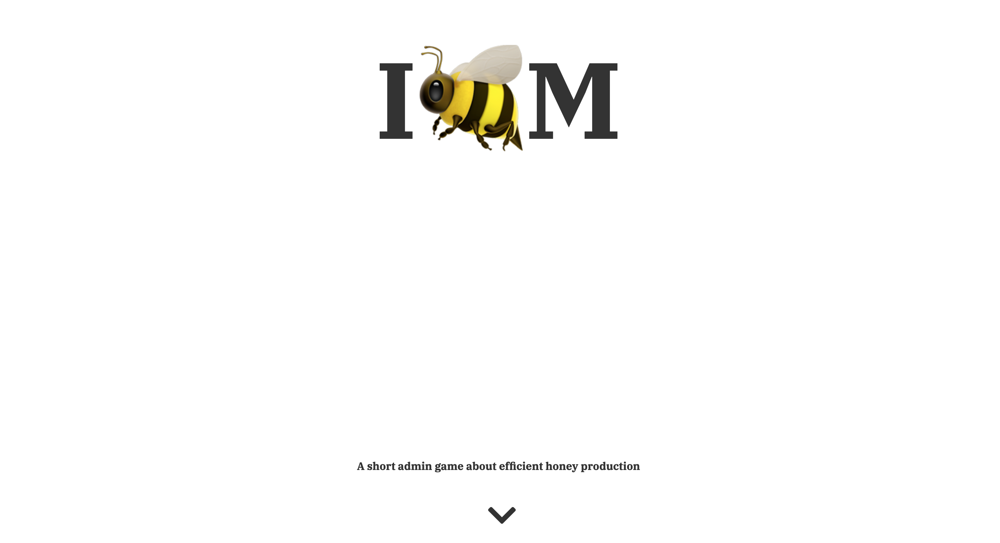
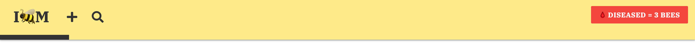
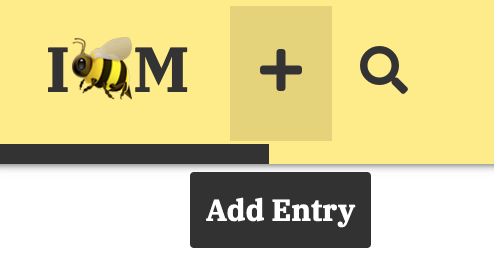
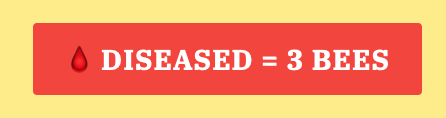
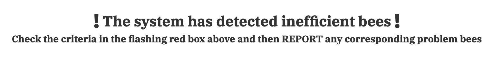
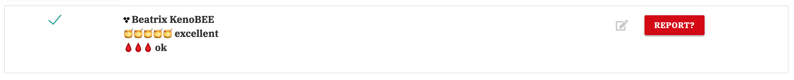
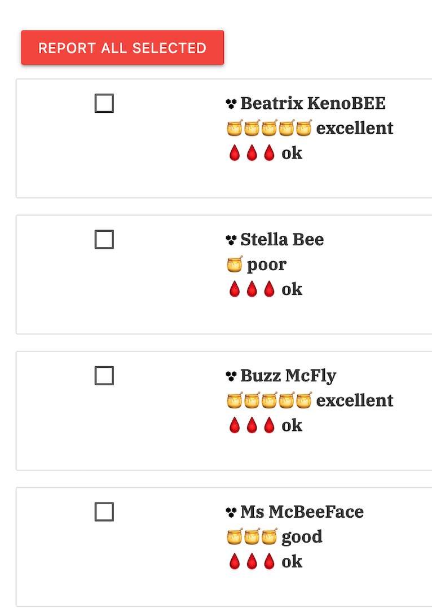

Live site: http://flask-task-manager-experiment.herokuapp.com/start

Works best on Desktop & Tablet (or horizontal mobile).

 
 

# ABOUT

A (somewhat) gamified CRUD experience. I would recommend 'playing' it before reading any further, as the information contained in this document might deflect from the first-time experience...

 
 

# PRODUCT SHOT

 
 

# UX

## User Stories

First Time Visitor Goals

>I want to play a game.

>I want to understand what my task is.

>I want to navigate the app/site, effortlessly.

 

Returning Visitor Goals

>I want to show a friend this dull but disturbing thing I found.

>I want to see what happens when I 'save' the bees.

>I want a quick way to get in contact with the creator.

 

Frequent User Goals

> I enjoy creating ficitional bees and adding them to lists.

 
 

## Design

Colour Scheme
* White predominates (Apple/Tech vibes) with Yellow and Black used on buttons and the main menu. As ever Red is used to call attention to important information.
 

Typography
* The main font is 'IBM Plex Serif' with Serif as the fallback.
 

Wireframes
* [Title Screen](static/images/rm-wf1.png)
* [Story](static/images/rm-wf2.png)
* [Signup](static/images/rm-wf3.png)
* [Create](static/images/rm-wf4.png)
* [Read](static/images/rm-wf5a.png)
* [Update](static/images/rm-wf5b.png)
* [Delete](static/images/rm-wf5c.png)
* [Congrats](static/images/rm-wf6.png)
* [IBM](static/images/rm-wf7.png) 
* [Game Over](static/images/rm-wf8.png) 
 
 

# LIBRARIES, FRAMEWORKS & PROGRAMS USED

1. Materialize:
    * Materialize was used throughout for layout, buttons etc.

2. Google Fonts:
    * Google fonts was used for 'IBM Plex Serif'.

3. Font Awesome:
    * Font Awesome was for the top icon and the social media link.

4. Gitpod:
    * Gitpod was used for all code creation and pushing to GitHub.

5. GitHub:
    * GitHub was used to store the projects code after being pushed from Gitpod.

6. Photoshop:
    * Photoshop was used to create a fake 'handwritten' picture of a bee's data.

7. Balsamiq:
    * Balsamiq was used to create the wireframes during the design process.

8. Full Page JS:
    * The javascript library Full Page JS was used for the start and end pages.

9. [Web Formater](https://webformatter.com/):
    * To format my html, css code and Javascript.

10. Heroku:
    * For hosting the app/site, synced to GitHub.

11. MongoDB:
    * For database hosting and backend CRUD functionalitity.

12. Jinja:
    * Template engine 

13. Flask:
    * Framework used to write the web application.

14. Python:
    * For all the game logic and CRUD operations.
 
 

# FEATURES 

## Landing page

 
A visual gag. A simple and straightfoward website design with genocidal cleanliness.

## Top HUD

 
The top nav bar contains the logo, an 'add' bee function, a search function and a notification of the number of problem bees.

## Hover

 
Each item brings up a descriptive box on mouser hover.

## Progress Bar

 
A subtle progress bar updates with each completed task. 

## Notifications

 
A red box detailing the current task.

## Instructions

 
Just to make it clear what the user has to do.

## Report?

 
Each lis item contains the name, productivity and health of each bee. They can either be selected, edited or individually reported.

## Select many

 
Each bee can either be selected and then batch 'reported'. There is also a REPORT ALL SELECTED button on the bottom of the page.
 
 

# Testing User Stories from User Experience (UX) Section

## First Time Visitor Goals:

>I want to play a game.

Well, this one probably isn't going to be that fun.

 

>I want to understand what my task is.

The opening story, menu instructions and flashing red icons should communicate what needs doing.

 

>I want to navigate the app/site, effortlessly.

The UI is straight forward enough and as a one-shot experience there is a flow to the UX.

 

## Returning Visitor Goals:

>I want to show a friend this dull but disturbing thing I found.

Your exisiting username probably doesn't exist anymore!

 

>I want to see what happens when I 'save' the bees.

Nothing new on-screen, but you're a good person. 

 

>I want a quick way to get in contact with the creator.

It's not obvious but it's at the bottom of the start page.

 

## Frequent User Goals:

> I enjoy creating ficitional bees and adding them to lists.

I like your style.
 
 

# FUTURE EXPANSION

* Only display bee information that pertains to the current task i.e. if the UI says find the 'diseased', the page doesn't show honey productivity. At the moment it's more intuitive to skip ahead and start reporting bees that aren't yet a focus of attention.

* More involved tasks! For example: finding the Admin or Head of BR (Bee Resources) log-in details on the list, then logging-in as them and reporting them as diseased / poor productivity, lol!

 
 

# TESTING

## Devices & Browsers

The site was tested on the following devices:

Device | OS | Browser
-------|----|---------
iPhone 8 | iOS 14 | Safari, Ghostery, Firefox 
Macbook Pro | Big Sur | Safari, Firefox, Chrome, Brave
iPad | iOS 14 | Safari, Firefox 
 
 

## Validator testing

HTML: A few errors detected on the [W3C validator](https://validator.w3.org/) but in reference to Jinja, tripping it up.

CSS: No errors were found when passing through the [Jigsaw W3C validator](https://jigsaw.w3.org/css-validator).

PYTHON: Code works with no syntax errors detected BUT a large list of pep8 recommendations came from [Pep8 online](http://pep8online.com). Sadly I haven't given myself enough time to correct all the code for the deadline... :/
 
 

## Lighthouse results

Desktop:  
Whilst the 'start' page generally [scored well](static/images/rm-lh1.png), the main page (get_tasks) only scored well in [performance](static/images/rm-lh2.png), with the [score of 58 for Accessibility](static/images/rm-lh3.png) indicative of the further work and time needed to make this app/site up to professional standards.
 
 

## Known bugs

1. This isn't great on vertical mobile screens:
* The start page nav arrows overlaps with other pages. It doesn't look pretty.
* The list items are squashed up and overlap.
* The notification UI overlaps the search function.

2. The 'end' page canvas seems to be overly large!

3. Once you've finished the game the program wipes your username, but only if you get to the end page. If you quit half way through then come back, you can't login. It tells you that the username already exists and you have to create a new username and password to get in. Given that the game is so short, is it a bug or a feature?

4. Not a bug but.... There is no modal 'confirm delete' on the main page, I like the idea that this process is flippant and 'efficient' however there is a confirmation box if you decide to edit an entry. It adds to the more time consuming nature of doing the right thing.

 
 

# DEPLOYMENT

Heroku:
* Login to Heroku
* Create a new app > create-a-name-with-dashes > select region closest to you (Europe) > create app.
* Under the Deploy tab > connect to GitHub > add depository name > search > connect.
* Under the Heroku's Settings tab > click Reveal Config files
* Enter 'I.P' and '0.0.0.0' 
* Enter 'Port' and '5000'
* Enter 'SECRET_KEY' and (matching value from env.py)
* Enter 'MONGO_URI' and (value from MongoDB > Databases > Connect > Connect your applications ("mongodb+srv://" etc)
* Enter 'MONGO_DBNAME' and (matching value from env.py)
* (Using your CLI add/push procfile and requirements.txt to your github)
* Under Heroku's Deploy tab > enable Automatic Deployment > then click Deploy Branch (to main).
* Once it's built click 'View'.

 
 

# CREDITS

## Code: 

GENERAL:

The 'game' owes an obvious debt to the Task Manager mini-project and certain labels remain (i.e. get_tasks or task_name for the bees name etc).

The Materlize website in general was used for buttons, navbar, modals etc.

The select multiple / check box code is my own, but I figured it out after watching [this video](https://youtu.be/DOrJ0tvz0Ow?t=299) about how to do it with SQL.

SPECIFIC:

Fullpage.css is obviously not mine and style.css contains comments where I've used others code.

CSS Progress Bar (Line 1-16 style.css) - It took a few different resources to figure out how to make one and whilst I modified it to fit, the CSS code is not mine. The Python is.
[1](https://www.w3schools.com/cssref/css3_pr_animation-keyframes.asp) [2](https://www.geeksforgeeks.org/how-to-create-a-progress-bar-animation-using-html-and-css/) [3](https://stackoverflow.com/questions/51383352/change-css-with-python-and-flask)

Clearing flask messages (Line 187 app.py) - I was getting bugs on the main menu displaying too many messages, [this](https://stackoverflow.com/questions/63387031/how-to-clear-existing-flash-messages-in-flask) fixed it.

 
 